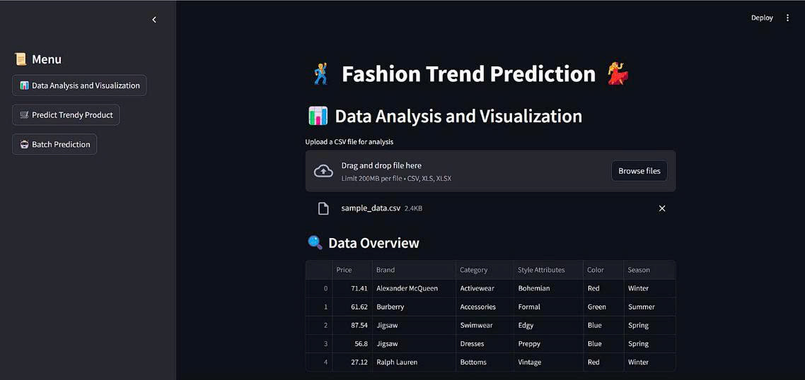
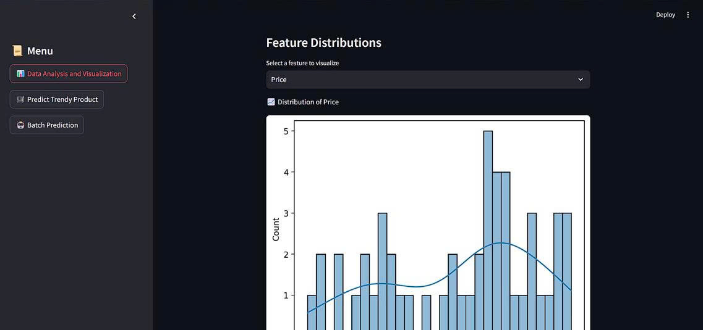
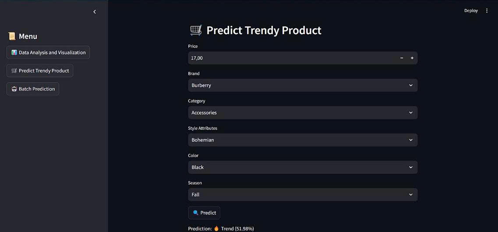
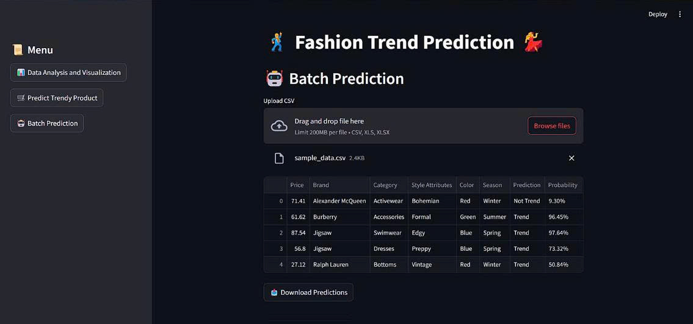

# 👗 Fashion Trend Prediction with Machine Learning

This project leverages the **XGBoost Classifier** to predict fashion trends by analyzing key product attributes such as color, size, and style. It is designed to help fashion brands and retailers optimize production strategies and stay ahead of market shifts.

---

## 📸 Demo Screenshots






## ✨ Features
* **Trend Forecasting:** Predicts the market viability of fashion items.
* **Feature Importance:** Identifies which attributes (Color, Style, etc.) drive trends.
* **Interactive UI:** A sleek web dashboard built with **Streamlit**.
* **Scalable Model:** Uses XGBoost for high-speed and high-accuracy classification.

---

## 🛠️ Technology Stack
* **Language:** Python
* **ML Model:** XGBoost Classifier
* **Library:** Scikit-learn, Pandas, NumPy
* **Frontend:** Streamlit

---

## 💻 Local Setup & Installation

To run this project locally, follow these steps:

1. **Clone the repository:**
   ```bash
   git clone [https://github.com/36JungKwan/Fashion-Trend-Prediction.git](https://github.com/36JungKwan/Fashion-Trend-Prediction.git)
   cd Fashion-Trend-Prediction
   ```

2. **Install requirements:**
   ```bash
   pip install -r requirements.txt
   ```

3. **Launch the application:**
   ```bash
   streamlit run app.py
   ```


## 🌐 Live Application

The web app is deployed on Streamlit Cloud. Access it here: [Streamlit Web App](https://fashionn.streamlit.app/)

## 📊 Sample Data for Testing

Data sample for web testing: [Data sample](https://drive.google.com/file/d/1zxI2KJoxPOXxZL406qfLOf4Aek7-QR-C/view?usp=drive_link)


